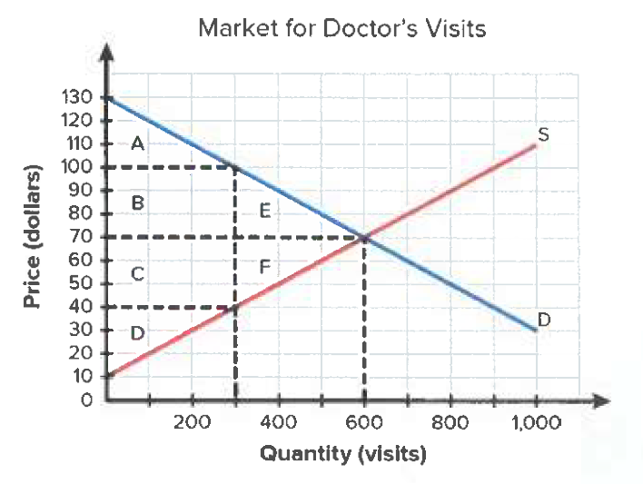
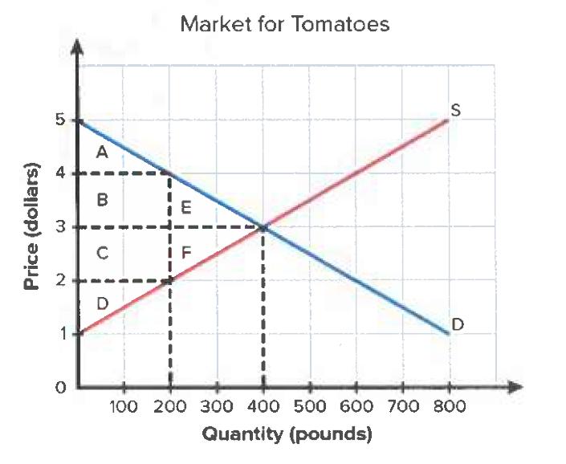
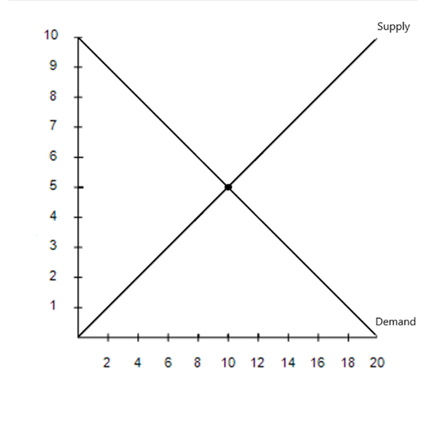

```{=html}
<a href="../beco3310.html" class="back-link">&larr; Back to all materials</a>

<div class="hw-container">

<div class="hw-info">
  <p><strong>Homework 1 of 3</strong></p>
  <p>Area calculation formulas:</p>
  <ul>
    <li>&frac12; &times; base &times; height for triangles</li>
    <li>length &times; width for rectangles</li>
  </ul>
</div>

<div class="hw-figure">
  
  <p class="figure-caption">Figure 1</p>
</div>

<div class="hw-question">
  <p><strong>1.</strong> Refer to Figure 1 above: List and calculate the consumer surplus &amp; producer surplus in the market for doctor's visits when in competitive equilibrium, using the letters provided in the triangles &amp; rectangles.</p>
</div>

<div class="hw-question">
  <p><strong>2.</strong> Refer to Figure 1 above: Suppose the government limits the amount of doctor's visits to be made to 300. Label the consumer surplus, producer surplus, &amp; deadweight loss, using the letters provided in the triangles &amp; rectangles. Calculate the area of each.</p>
</div>

<div class="hw-figure">
  
  <p class="figure-caption">Figure 2</p>
</div>

<div class="hw-question">
  <p><strong>3.</strong> Refer to Figure 2 above: List and calculate the consumer surplus &amp; producer surplus in the market for tomatoes when in competitive equilibrium, using the letters provided in the triangles &amp; rectangles.</p>
</div>

<div class="hw-question">
  <p><strong>4.</strong> Refer to Figure 2 above: Suppose the government imposes a price floor of $4 in the market for tomatoes. Label the consumer surplus, producer surplus, &amp; deadweight loss, using the letters provided in the triangles &amp; rectangles. Calculate the area of each.</p>
</div>

<div class="hw-question">
  <p><strong>5.</strong> Explain what will happen to the equilibrium price, quantity, and economic welfare (consumer &amp; producer surplus) if the price floor is non-binding.</p>
</div>

<div class="hw-figure">
  
  <p class="figure-caption">Figure 3</p>
</div>

<div class="hw-question">
  <p><strong>6.</strong> Use the graph above to do the following: Explain what would happen to price and quantity if the following circumstances happened:</p>
  <ul>
    <li>Demand increases</li>
    <li>Supply increases</li>
    <li>Demand and supply increase</li>
    <li>Demand decreases while supply increases</li>
    <li>Supply decreases while demand increases a little bit</li>
  </ul>
</div>

<div class="hw-question">
  <p><strong>7.</strong> Elasticity: Answer the following questions</p>
  <ol type="a">
    <li>A 10% increase in the price of movie tickets causes the quantity demanded to fall by 25%. Is the demand elastic or inelastic?</li>
    <li>The price of salt rises by 20%, but the quantity demanded only falls by 1%. Is the demand elastic or inelastic?</li>
    <li>A 5% increase in the price of coffee leads to a 15% increase in the quantity supplied. Is the supply elastic or inelastic?</li>
    <li>When consumer income increases by 10%, the demand for instant noodles falls by 8%. Is this good normal, inferior, or a luxury?</li>
    <li>When income rises by 15%, the demand for international vacations rises by 30%. Is this good normal, inferior, or a luxury?</li>
    <li>The price of Coca-Cola increases, and as a result, the demand for Pepsi rises. Are Coca-Cola and Pepsi substitutes or complements?</li>
    <li>The price of smartphones decreases, and the demand for phone cases increases. Are smartphones and phone cases substitutes or complements?</li>
  </ol>
</div>

<div class="hw-question">
  <p><strong>8.</strong> Using what you've learned from the reading "I, Pencil," explain:</p>
  <ol type="a">
    <li>How does "I, Pencil" illustrate the idea that no single person knows how to make something as simple as a pencil? What does this reveal about the role of specialized knowledge in economics?</li>
    <li>What role does the "invisible hand" play in coordinating all the people and resources involved in making a pencil, even though none of them intend to make a pencil specifically?</li>
    <li>The essay highlights materials from around the world (cedar, graphite, rubber, etc.). How does "I, Pencil" help us understand the importance of global trade and interdependence in modern economies?</li>
  </ol>
</div>

</div>
```
