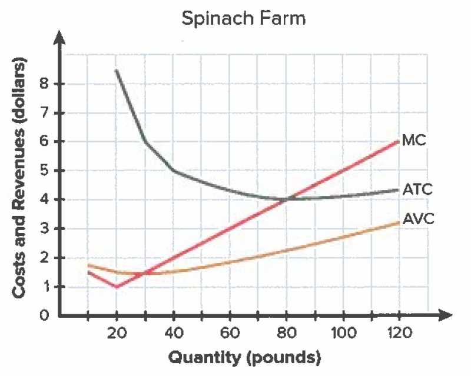

```{=html}
<a href="../beco3310.html" class="back-link">&larr; Back to all materials</a>

<div class="hw-container">

<div class="hw-figure">
  
  <p class="figure-caption">Figure 1</p>
</div>

<p>Figure 1 shows the cost curves for an individual spinach farm.</p>

<div class="hw-question">
  <p><strong>1.</strong> Refer to Figure 1 above: If the market price for spinach is $3, should the farm continue to produce in the short-run? Intuitively explain why or why not.</p>
</div>

<div class="hw-question">
  <p><strong>2.</strong> Refer to Figure 1 above: If the market price for spinach is $5, should the farm continue to produce in the short-run? Intuitively explain why or why not.</p>
</div>

<div class="hw-question">
  <p><strong>3.</strong> Refer to Figure 1 above: If the market price for spinach is $4, should the farm continue to produce in the short-run? Intuitively explain why or why not.</p>
</div>

<div class="hw-question">
  <p><strong>4.</strong> List the four assumptions of the perfectly competitive market.</p>
</div>

<div class="hw-question">
  <p><strong>5.</strong> Intuitively explain why competitive firms choose the quantity that maximizes profit.</p>
</div>

<div class="hw-question">
  <p><strong>6.</strong> Suppose last year you opened a bakery. You had $90,000 in explicit costs which included wages to your employees, equipment and rent for the bakery, and the costs of ingredients. You also incurred $61,000 in implicit costs, including the $60,000/year salary you earned at your previous job. Over the course of the year, you sold 20,000 baked goods at an average price of $10 each.</p>
  <ol type="a">
    <li>What were your accounting profits last year?</li>
    <li>What were your economic profits last year?</li>
  </ol>
</div>

<div class="hw-question">
  <p><strong>7.</strong> Intuitively explain why running shoes are not a standardized, or homogenous, product and inappropriate to be used as an example in the perfectly competitive market model.</p>
</div>

</div>
```
