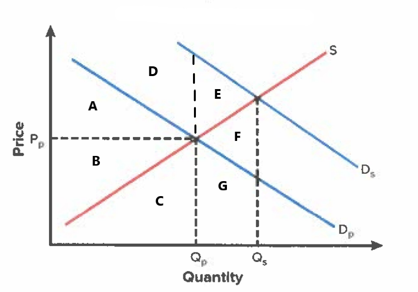
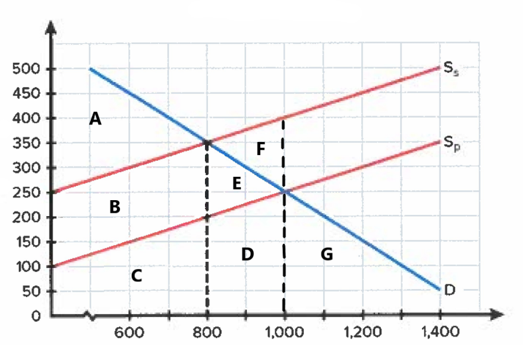
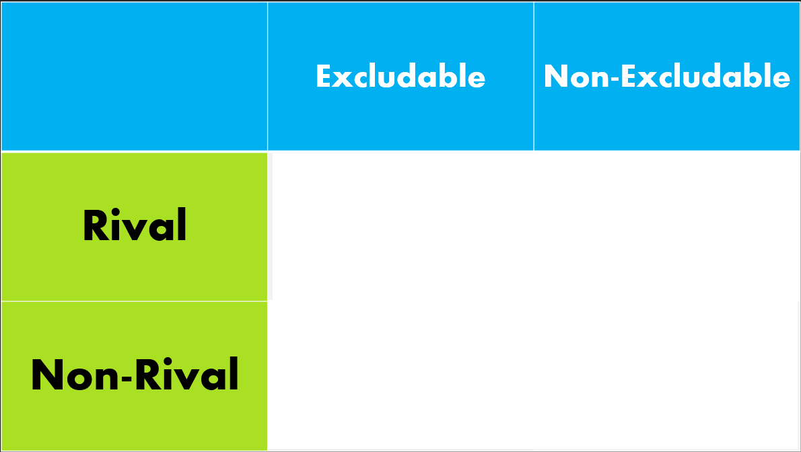

```{=html}
<a href="../beco3310.html" class="back-link">&larr; Back to all materials</a>

<div class="hw-container">

<div class="hw-info">
  <p><strong>Material/Lectures Covered:</strong> Monopoly I &amp; II, Externalities &amp; Transaction Costs, Public Goods, Asymmetric Information, Public Choice</p>
</div>

<div class="hw-question">
  <p><strong>1.</strong> For each of the following examples, determine whether there is an external cost or benefit associated with use of the good and explain why.</p>
  <ol type="i">
    <li>Flu Vaccines</li>
    <li>Cigarettes</li>
    <li>Loud Music</li>
  </ol>
</div>

<div class="hw-question">
  <p><strong>2.</strong> The graph below shows a market in which there is a positive externality. Label the area(s) for deadweight loss.</p>
  <div class="hw-figure">
    
  </div>
</div>

<div class="hw-question">
  <p><strong>3.</strong> The graph below shows a market in which there is a negative externality. Label the area(s) for deadweight loss.</p>
  <div class="hw-figure">
    
  </div>
</div>

<div class="hw-question">
  <p><strong>4.</strong> Place private goods, public goods, club goods, and common pool resources in their respective spot in the goods matrix below.</p>
  <div class="hw-figure">
    
  </div>
</div>

<div class="hw-question">
  <p><strong>5.</strong> Going back to our example from class about used cars, are people right to be skeptical about used car markets? Intuitively explain why or why not.</p>
</div>

<div class="hw-question">
  <p><strong>6.</strong> About private goods, public goods, club goods, and common pool resources. Give one example of each and briefly explain why they are that type.</p>
</div>

<div class="hw-question">
  <p><strong>7.</strong> When one says that public choice is "politics without romance," what does that mean? Intuitively explain using the language and tools of economics from class.</p>
</div>

<div class="hw-question">
  <p><strong>8.</strong> Draw a graph of a monopoly (seen several times in class) and explain where on the graph the monopoly will produce (quantity) and what price it will charge.</p>
</div>

</div>
```
