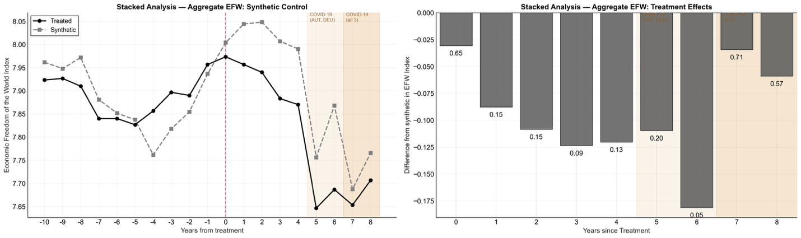
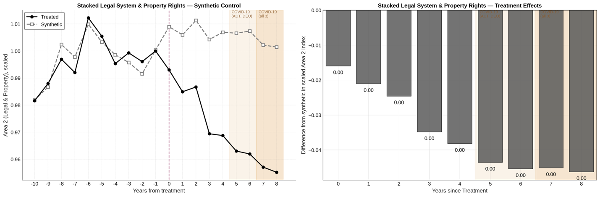
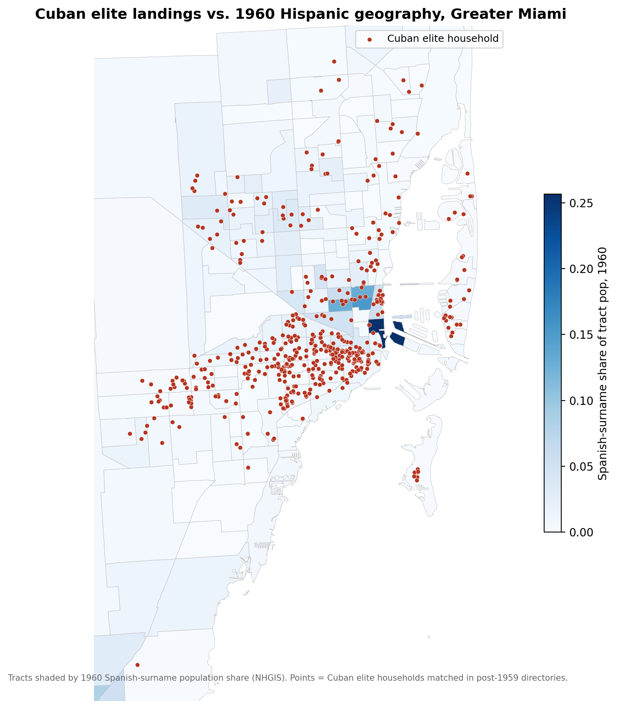
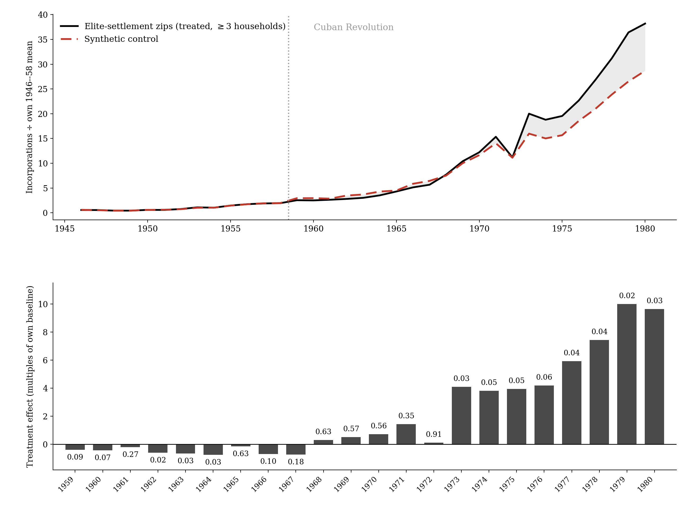
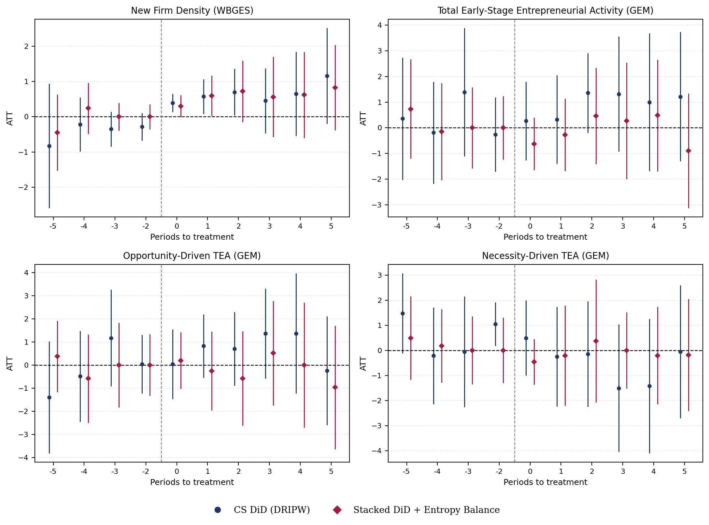
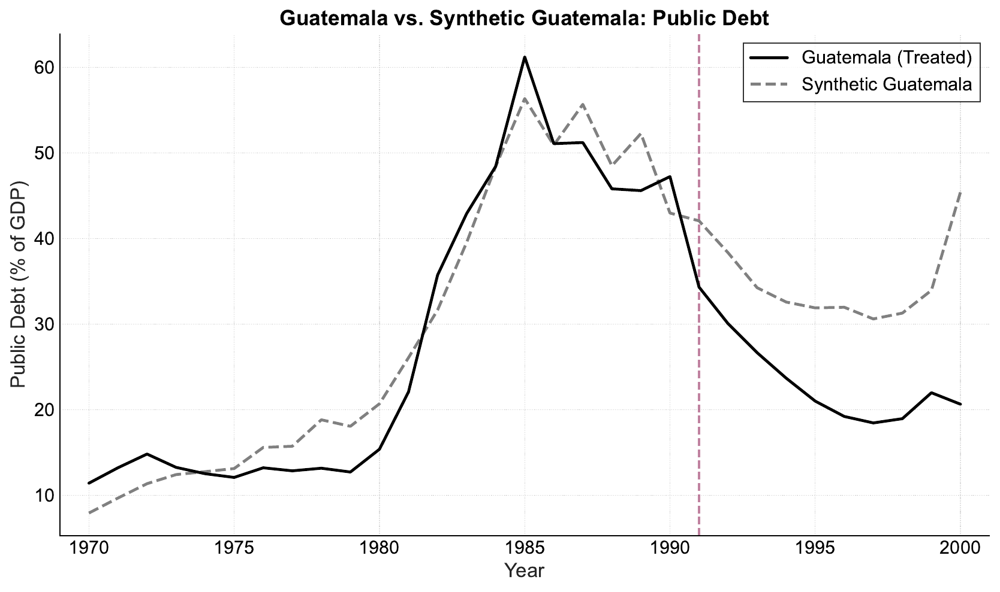
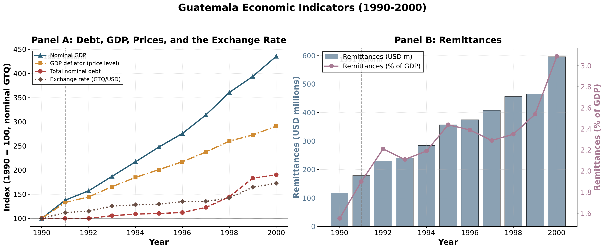

My research focuses on migration, entrepreneurship, and political economy, with an emphasis on how institutions, policy environments, and economic incentives shape individual behavior and long-run development outcomes. Click a topic below to filter.

<!-- Sidebar with topic filters -->

<h5 class="sidebar-heading">Topics</h5>
<button class="topic-btn active" data-filter="all">All</button>
<button class="topic-btn" data-filter="migration">Migration</button>
<button class="topic-btn" data-filter="entrepreneurship">Entrepreneurship</button>
<button class="topic-btn" data-filter="fiscal">Fiscal & Monetary Policy</button>
<button class="topic-btn" data-filter="political">Political Economy</button>

<h5 class="sidebar-heading" style="margin-top:1.2rem;">Status</h5>
<label class="status-checkbox"><input type="checkbox" class="status-filter" value="published" checked> Published</label>
<label class="status-checkbox"><input type="checkbox" class="status-filter" value="under-review" checked> Under Review / R&R</label>
<label class="status-checkbox"><input type="checkbox" class="status-filter" value="working" checked> Working Papers</label>

<!-- Main content area -->

<!-- ── Syria Refugees Paper ── -->

Migration
Forthcoming

<h4 class="card-title"><a href="publications/Powell_Regalado_Syrian_Refugees_European_Economic_Freedom_2026.pdf" target="_blank" rel="noopener">Syrian refugees and the resilience of European economic freedom: Evidence from Austria, Germany, and Sweden</a></h4>

with Benjamin Powell &middot; <em>Journal of Comparative Economics</em>, Forthcoming

We find no robust evidence that the Syrian refugee surge lowered overall economic freedom in Austria, Germany, or Sweden, though Germany and Sweden show suggestive declines in legal system and property rights.

Read more

The Syrian civil war sent more than a million refugees to Europe, concentrated in a few countries: by 2022 Germany hosted 612,000 Syrians, Sweden 232,000, and Austria 77,000, reaching 2.2% of Sweden's population. That makes it a strong test of the &ldquo;new economic case for immigration restrictions,&rdquo; the claim that migrants from countries with poor institutions erode the institutions where they settle. We build <strong>synthetic controls</strong> for each country's Economic Freedom of the World (EFW) score from European countries that received few Syrian refugees, then stack the three to estimate an average effect.

<figure>

<figcaption>Stacked synthetic control for overall EFW (left) and yearly gaps with placebo <em>p</em>-values (right). Shaded years overlap COVID-19.</figcaption>
</figure>

Overall economic freedom fell by more than its synthetic counterpart in every post-treatment year, but the gaps are small, about 0.11 points on average, and not significant in 7 of 9 years (joint <em>p</em>&nbsp;=&nbsp;0.106). The <strong>Legal System and Property Rights</strong> area is different: its stacked gap widens steadily, driven by Germany and Sweden, which we read as suggestive rather than conclusive.

<figure>

<figcaption>Stacked synthetic control for Legal System and Property Rights (EFW Area 2; left) and yearly gaps with placebo <em>p</em>-values (right).</figcaption>
</figure>

<!-- ── Cuban Businessmen Paper ── -->

Migration
Entrepreneurship

Working Paper

<h4 class="card-title">Move to Miami: Cuban Elite Exiles, Local Economic Outcomes, and Business Formation</h4>

with Carlos Martinez &middot; <strong>Job Market Paper</strong>

Where Cuba's exiled business elite settled after 1959, unemployment ended up lower and new business formation took off from the late 1960s.

Read more

Cuba's first post-revolution exiles were disproportionately business owners, managers, and professionals, and many reached Florida with skills but little capital. We identify them <strong>by name</strong>, linking two 1958 Cuban elite registers to Florida telephone directories and corporate filings, and follow the places where at least three elite households settled by 1964 through 1980.

<figure>

<figcaption>Cuban elite households located in post-1959 Miami directories, against each census tract's 1960 Spanish-surname population share.</figcaption>
</figure>

Matched difference-in-differences shows that unemployment rose 2.0 to 2.7 percentage points less between 1960 and 1980 in Miami tracts where the elite settled, with no consistent effect on employment or family income. <strong>Synthetic control</strong> estimates for 41 Florida zip codes show incorporations in elite-settlement zip codes rising from 3.81 to 10.00 times their own pre-1959 average relative to their synthetic controls in significant years, with the gap opening in the late 1960s.

<figure>

<figcaption>New Florida incorporations relative to each zip code's own 1946&ndash;58 mean: elite-settlement zip codes versus their synthetic control (top), and yearly gaps with placebo <em>p</em>-values (bottom).</figcaption>
</figure>

<!-- ── Ideology and Economic Freedom Paper ── -->

Political Economy
Working Paper

<h4 class="card-title"><a href="publications/Regalado_Bastos_Powell_Ideology_Economic_Freedom_2026.pdf" target="_blank" rel="noopener">Leader's Ideology and Economic Freedom</a></h4>

with J.P. Bastos and Benjamin Powell

Do right-wing leaders expand economic freedom and left-wing leaders restrict it? Causal estimates show the effects are small and mostly absent.

Read more

A long-standing proposition holds that right-wing governments promote free markets while left-wing governments constrain them. This paper provides the first causal estimates of the effect of government leaders' ideology on economic freedom, using a <strong>doubly-robust stacked difference-in-differences</strong> design that accounts for staggered treatment timing and identifies clean ideological transitions following a stable pre-treatment period.

The analysis uses two samples: a global panel of 153 countries measured with the Economic Freedom of the World index, and 21 OECD countries reaching back to 1870 measured with the Historical Index of Economic Liberty.

Globally, transitions to either a left- or a right-wing government have no significant effect on economic freedom, and among OECD countries transitions to the right have no effect either. The two most robust findings are a <strong>small negative effect after transitions to the left among OECD countries</strong>, driven by a larger size of government, and a <strong>small positive effect after transitions to the right among non-OECD countries</strong>.

<!-- ── Corruption Paper ── -->

Entrepreneurship
Under Review

<h4 class="card-title"><a href="publications/Regalado_Cardoso_Corruption_Reforms_Entrepreneurship_2026.pdf" target="_blank" rel="noopener">Do corruption reforms spur entrepreneurship?</a></h4>

Under review at the <em>Journal of Institutional Economics</em>

Sustained anti-corruption reforms briefly raise formal firm registration, but have no lasting effect on entrepreneurship.

Read more

I identify sustained five-year improvements in the ICRG corruption index, following Bologna Pavlik et al. (2023), and estimate their effect with two designs: the <strong>Callaway and Sant'Anna (2021)</strong> difference-in-differences estimator and an <strong>entropy-balanced stacked</strong> difference-in-differences. Entrepreneurship is measured two ways: new formal firms per 1,000 working-age people from the World Bank (24 treated countries) and early-stage entrepreneurial activity from the Global Entrepreneurship Monitor (20 treated countries).

<figure>

<figcaption>Event-study estimates for four outcomes. Circles: Callaway&ndash;Sant'Anna; diamonds: entropy-balanced stacked DiD. Bars are 95% confidence intervals.</figcaption>
</figure>

Formal registrations rise right after reform, consistent with corruption acting as &ldquo;sand in the wheels,&rdquo; but the effect loses significance within three years, while early-stage activity in the GEM data does not change. Reform appears to change the <em>form</em> of entrepreneurship, as informal firms formalize, rather than its level. The results hold under a stricter treatment threshold, a ten-year horizon, reverse treatment, and a sample extended past COVID-19.

<!-- ── Emigration Paper ── -->

Migration
Published

<h4 class="card-title"><a href="publications/Powell_Regalado_Emigration_Origin_Country_Economic_Institutions_2025.pdf" target="_blank" rel="noopener">Emigration and origin country economic institutions</a></h4>

with Benjamin Powell &middot; <em>Public Choice</em>, 2025

Moderate emigration improves origin-country economic institutions through an inverted-U relationship, driven by medium- and high-skill emigrant stocks.

Read more

Drawing on public choice theory and Hirschman's exit-voice framework, this paper identifies four channels through which emigration affects origin-country institutions: the <em>absence channel</em>, the <em>prospect channel</em>, the <em>diaspora channel</em>, and the <em>return channel</em>. These predict an inverted-U: moderate emigration improves institutions, but extreme levels deplete human capital and civic participation.

We test this using panel data on emigration from 132 countries to 20 OECD destinations (1980-2010) and the Economic Freedom of the World (EFW) index. Specifications include two-way fixed effects, quadratic terms, and skill-specific disaggregation.

<figure>

<figcaption>Predicted total effect of emigrant stock on EFW change, showing the inverted-U relationship peaking near 20% of the population abroad.</figcaption>
</figure>
<figure>

<figcaption>Skill-specific effects: medium- and high-skill emigrant stocks drive institutional improvements, with high-skill effects never turning negative within the observed range.</figcaption>
</figure>

The results confirm the <strong>inverted-U hypothesis</strong>. Emigrant stocks are positively and significantly associated with improvements in economic freedom, peaking at about 20% of the population abroad (a 0.90-point improvement on the 10-point EFW scale). Only above 47% does the effect turn negative, and only Guyana exceeds that threshold.

Medium- and high-skill emigrant stocks drive the result. High-skill emigration never turns negative within the observed range, suggesting persistent institutional spillovers. The policy implication: allowing greater emigration from low-freedom countries could promote development through institutional improvement, a channel that adds to the already large estimated gains from freer migration.

<!-- ── Property Rights Paper ── -->

Entrepreneurship
Published

<h4 class="card-title"><a href="publications/Regalado_Cardoso_Property_Rights_Entrepreneurship_2025.pdf" target="_blank" rel="noopener">Property rights and entrepreneurship</a></h4>

<em>Economic Affairs</em>, 45(3), 509-521, 2025

Property rights and total entrepreneurship follow a U-shaped relationship: necessity entrepreneurship falls first, then opportunity entrepreneurship rises.

Read more

The literature assumes a linear relationship between property rights and entrepreneurship. This paper challenges that assumption, proposing and testing a <strong>U-shaped (nonlinear) relationship</strong>. At low levels, necessity-driven entrepreneurship dominates. As institutions improve, formal jobs absorb this activity. Beyond a threshold, opportunity-driven entrepreneurship accelerates and total activity rises again.

The empirical analysis uses panel data from the Global Entrepreneurship Monitor across 90 countries (2004-2018, 822 observations), paired with the Fraser Institute's Legal System and Property Rights sub-index. The baseline is a random-effects panel regression of TEA on property rights and its square, controlling for GDP per capita, GDP growth, unemployment, and population growth.

<figure>

<figcaption>The U-shaped relationship: predicted TEA (solid curve) is driven by declining necessity entrepreneurship and rising opportunity entrepreneurship as property rights improve.</figcaption>
</figure>

The results confirm the <strong>U-shape</strong>. The linear term is negative and significant (&minus;5.590, p&lt;0.01), the quadratic term positive and significant (+0.418, p&lt;0.05), with a Wald test confirming the squared term matters (p&nbsp;=&nbsp;0.011). The minimum occurs at a score of approximately 6.69, comparable to Chile. A purely linear specification yields an <em>insignificant</em> coefficient, demonstrating it misses the true relationship entirely.

Separate regressions reveal the mechanism: each additional point in property rights increases opportunity entrepreneurship by 0.0432 pp (p&lt;0.01) while decreasing necessity entrepreneurship by 0.0142 pp (p&lt;0.01). The gain in opportunity ventures is more than <strong>three times</strong> the decline in necessity ventures. Results are robust to using the World Bank's Rule of Law index instead.

The policy implication: policymakers should not be discouraged if modest institutional improvements do not immediately produce a surge in business creation. The initial decline reflects a healthy transition away from survivalist informality. The payoff comes with sustained reform past the trough.

<!-- ── Fiscal Rules Guatemala Paper ── -->

Fiscal & Monetary Policy
R&R

<h4 class="card-title"><a href="publications/Regalado_Cardoso_Debt_Constraints_Guatemala_2026.pdf" target="_blank" rel="noopener">Debt Constraints in Emerging Economies: Evidence from Guatemala</a></h4>

R&amp;R at <em>Public Finance Review</em>

Guatemala's 1991 rule against central bank financing ended debt monetization, but the fall in debt-to-GDP came from inflation, not fiscal discipline.

Read more

After a 1980s crisis in which inflation peaked near 60% and the fixed exchange rate collapsed, Guatemala limited central bank lending to the government, first through a 1991 Monetary Board resolution and then a 1993 constitutional amendment. Using the <strong>synthetic control method</strong> with 1991 as the treatment year, I find that Guatemala's debt-to-GDP ratio falls below its synthetic counterfactual, with a gap averaging nearly 12 percentage points over 1991&ndash;2000. The gap is significant in only one year (2000), and a synthetic difference-in-differences estimate of &minus;10.6 points is not significant.

<figure>

<figcaption>Public debt as a share of GDP: Guatemala and synthetic Guatemala. The dashed line marks the 1991 reform.</figcaption>
</figure>

The mechanism explains why. Central bank financing ended, but the government kept borrowing through other channels and total nominal debt kept rising. The ratio fell because inflation pushed <strong>nominal GDP</strong> up far faster than the debt stock, while growing remittances supported a slow, managed depreciation. The rule bound on its target without producing a more conservative fiscal path.

<figure>

<figcaption>Guatemala, 1990&ndash;2000. Panel A: nominal GDP, the GDP deflator, total nominal debt, and the exchange rate (1990&nbsp;=&nbsp;100). Panel B: remittances in USD millions and as a share of GDP.</figcaption>
</figure>

