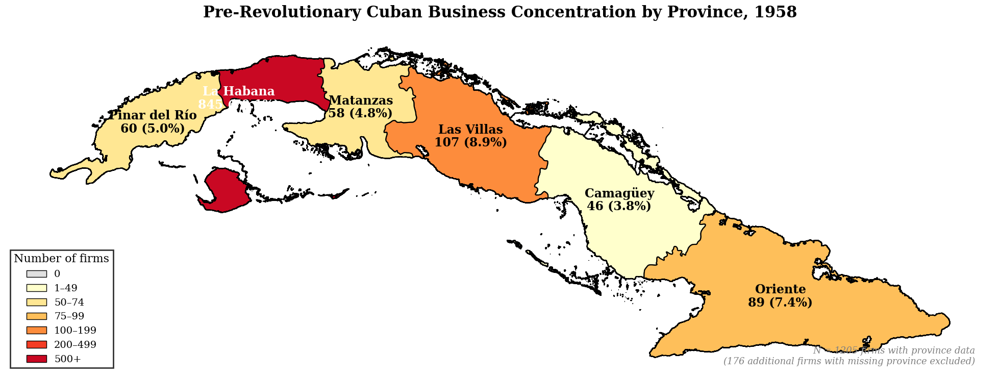
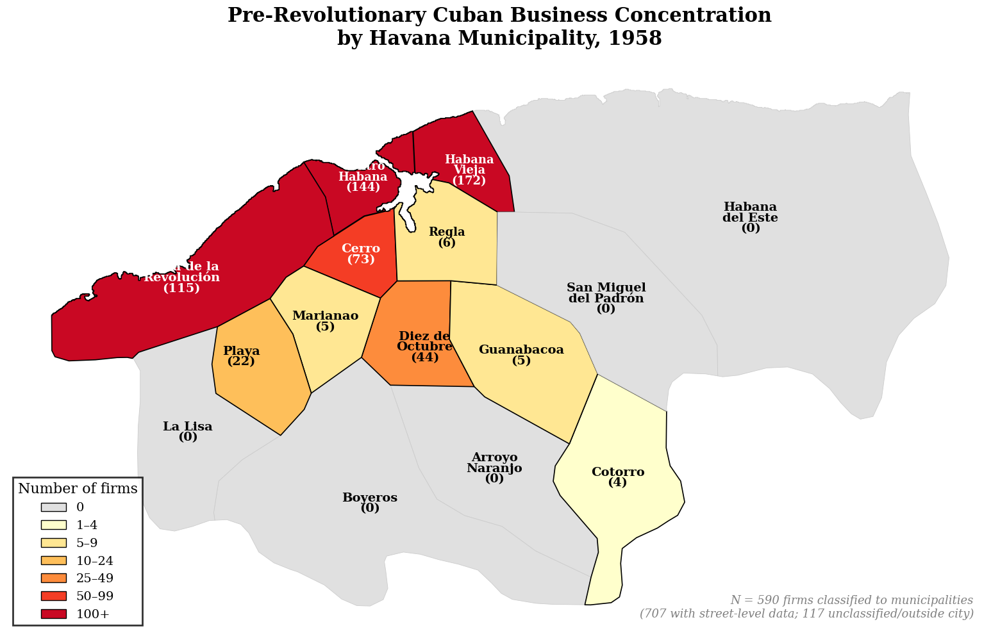
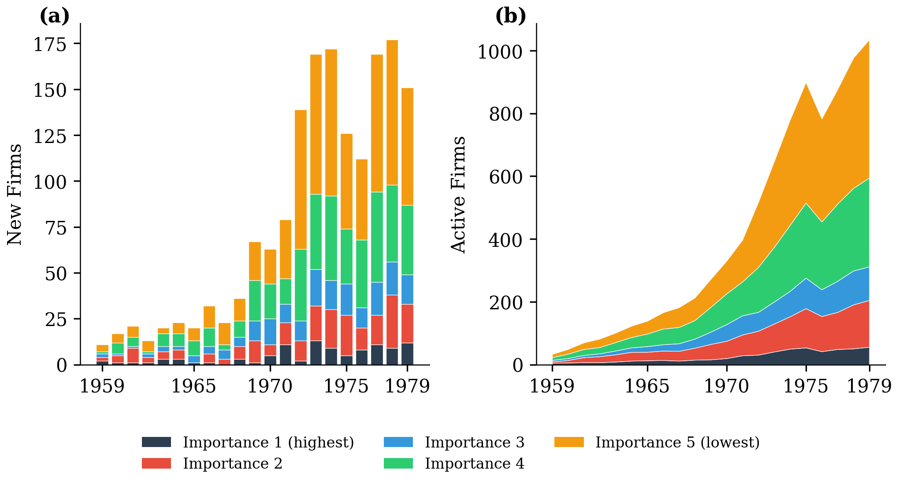
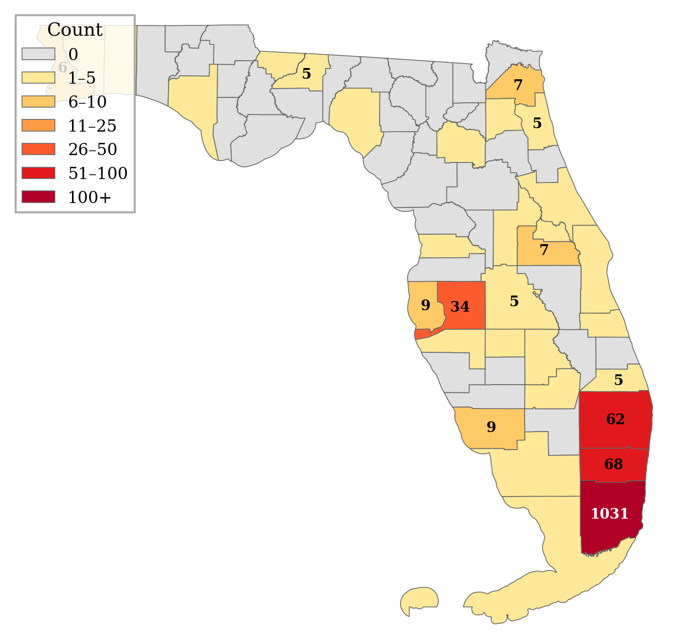
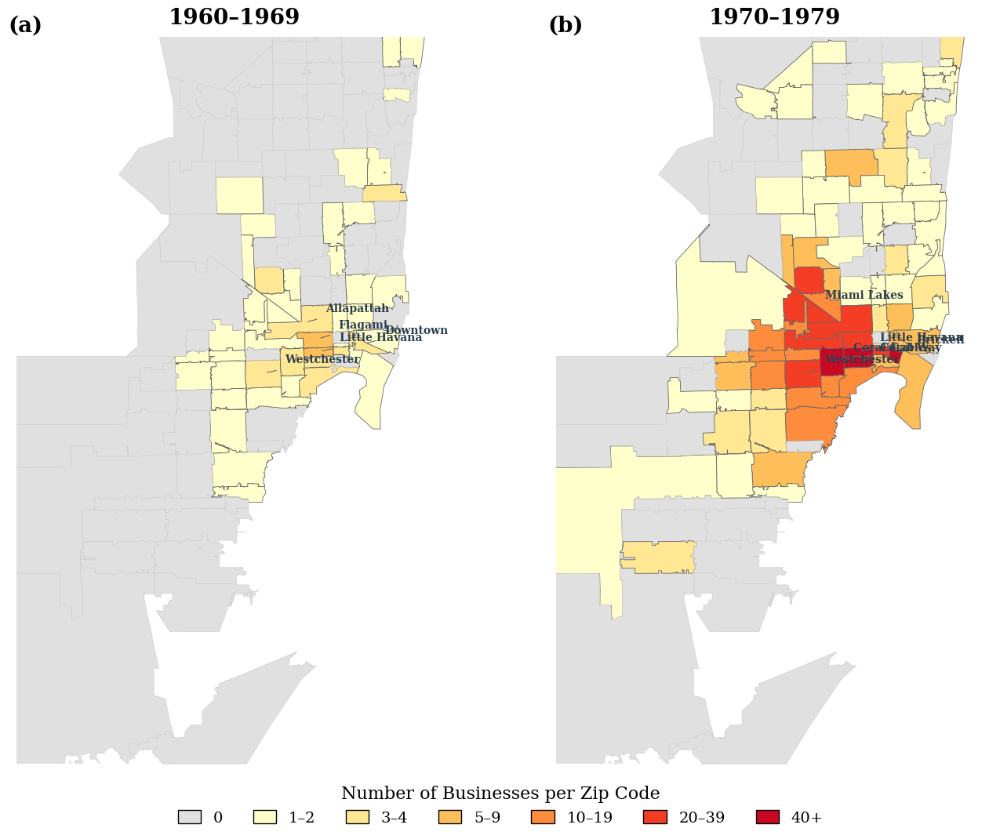
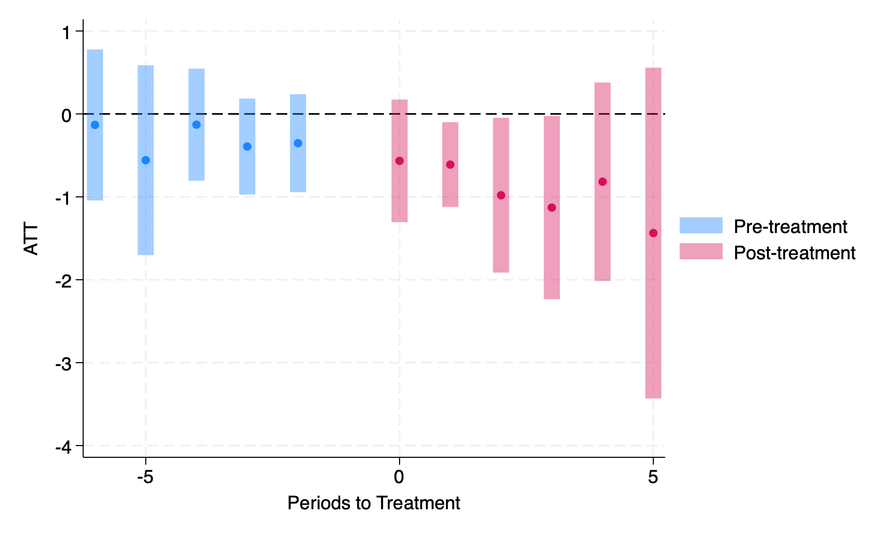
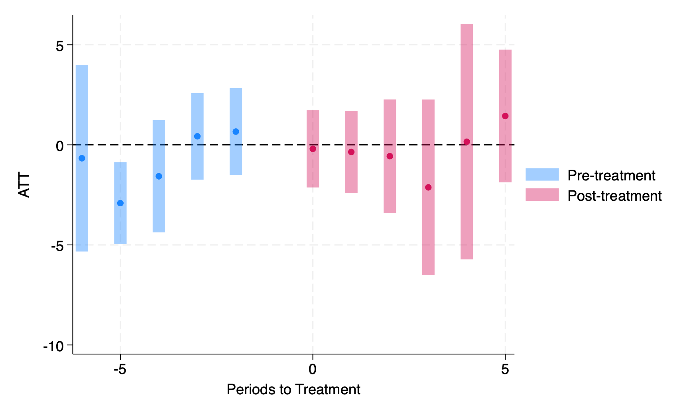
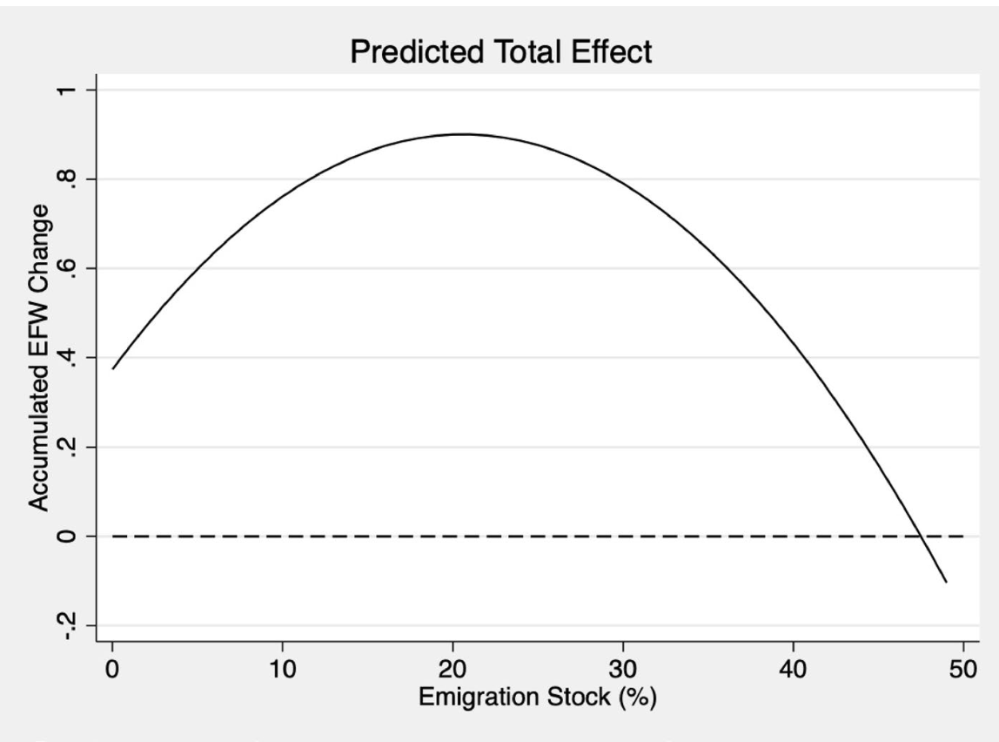
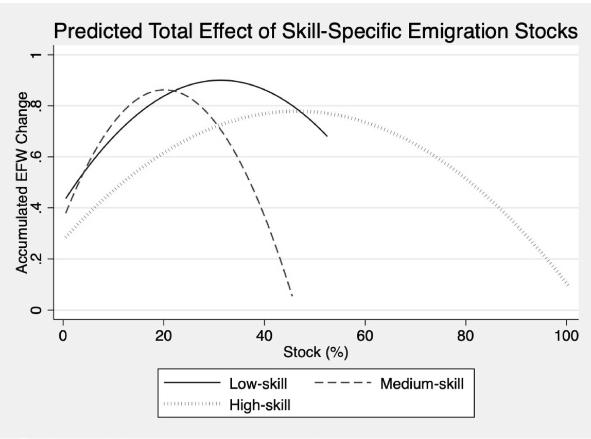
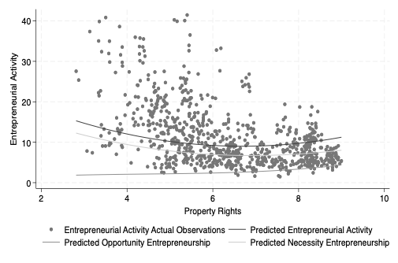

My research focuses on migration, entrepreneurship, and political economy, with an emphasis on how institutions, policy environments, and economic incentives shape individual behavior and long-run development outcomes. Click a topic below to filter.

<!-- Sidebar with topic filters -->

<h5 class="sidebar-heading">Topics</h5>
<button class="topic-btn active" data-filter="all">All</button>
<button class="topic-btn" data-filter="migration">Migration</button>
<button class="topic-btn" data-filter="entrepreneurship">Entrepreneurship</button>
<button class="topic-btn" data-filter="fiscal">Fiscal & Monetary Policy</button>

<h5 class="sidebar-heading" style="margin-top:1.2rem;">Status</h5>
<label class="status-checkbox"><input type="checkbox" class="status-filter" value="published" checked> Published</label>
<label class="status-checkbox"><input type="checkbox" class="status-filter" value="under-review" checked> Under Review / R&R</label>
<label class="status-checkbox"><input type="checkbox" class="status-filter" value="working" checked> Working Papers</label>

<!-- Main content area -->

<!-- ── Syria Refugees Paper ── -->

Migration
R&R

<h4 class="card-title">Did the Syrian Refugee Crisis impact European economic freedom?</h4>

with Benjamin Powell &middot; R&amp;R at the <em>Journal of Comparative Economics</em>

Using synthetic control methods, we find no evidence that the Syrian refugee surge eroded economic freedom in Germany, Austria, or Sweden.

Read more

The Syrian refugee crisis offers the hardest possible test of the claim that immigration erodes institutions. Syria scored 4.53 on the Economic Freedom of the World (EFW) index while host countries scored approximately 8.0, a gap of 3.5 points. Refugees are less self-selected than voluntary migrants, and the scale was unprecedented: Germany absorbed over one million Syrians, Sweden took in 2.2% of its population.

We apply the <strong>synthetic control method</strong> to construct counterfactual EFW trajectories for Germany, Austria, and Sweden using a donor pool of 21 European countries where the Syrian-born population remained below 0.1%. The most notable donors are the United Kingdom (carrying 47% of Austria's weight, 57% of Germany's, and 39% of Sweden's), the Czech Republic, France, Ireland, and Poland. We stack the three country-level analyses by aligning treatment years and averaging effects.

<figcaption>Stacked synthetic control: treated countries versus their synthetic counterfactual. Hover over the lines to see exact EFW values at each period.</figcaption>

<figcaption>Post-treatment effects with p-values. Hover over each bar to see the exact treatment effect and statistical significance.</figcaption>

<strong>The Syrian refugee surge did not meaningfully impact destination countries' economic freedom.</strong> All post-treatment point estimates are negative but small; the largest gap is just 0.18 points in period 6, and most are statistically insignificant. Only period 6 reaches conventional significance (p&nbsp;=&nbsp;0.05), with a joint p-value of 0.106. Sweden is the most striking case: despite having the highest refugee ratio and fastest naturalization pathway (58% naturalized by 2023), it shows <em>no</em> significant effects in any year. Results are robust to dropping the UK from the donor pool, using all pre-treatment lags without covariates, and adding immigrant stock as a covariate.

The Syrian case is particularly informative because the conditions for detecting erosion are maximally favorable. If institutional erosion were going to happen anywhere, it should have happened here.

<!-- ── Cuban Businessmen Paper ── -->

Migration
Entrepreneurship

Working Paper

<h4 class="card-title">From Das Kapital to Venture Capital: Cuban Entrepreneurial Elites Exiled in South Florida</h4>

with Carlos Martinez

Coming soon...

See figures

<figure>

<figcaption>Cuban businesses by province, 1958.</figcaption>
</figure>
<figure>

<figcaption>Havana business locations, 1958.</figcaption>
</figure>
<figure>

<figcaption>Cuban-proprietor-owned businesses in South Florida by ZIP and year.</figcaption>
</figure>
<figure>

<figcaption>Cuban-proprietor-owned businesses across Florida by county.</figcaption>
</figure>
<figure>

<figcaption>Cuban-proprietor-owned business locations in Miami-Dade County.</figcaption>
</figure>

<!-- ── Corruption Paper ── -->

Entrepreneurship
Working Paper

<h4 class="card-title">Do corruption reforms spur entrepreneurship?</h4>

&nbsp;

Sustained anti-corruption reforms have no statistically significant effect on any measure of entrepreneurship, suggesting growth gains flow through other channels.

Read more

Pavlik et al. (2023) showed that sustained anti-corruption reforms cause economic growth, but through what channel? This paper applies the <strong>Callaway and Sant'Anna (2021) DiD estimator</strong>, which properly handles staggered treatment adoption, to test whether reducing corruption boosts business creation. Treatment is defined as a sustained 5-year improvement of more than 0.20 in the World Bank's Control of Corruption index.

The analysis uses two complementary datasets: the World Bank Group Entrepreneurship Survey (formal firm registrations per 1,000 working-age people, 20 treated countries) and the Global Entrepreneurship Monitor (total, opportunity-driven, and necessity-driven TEA, 10 treated countries).

<figure>

<figcaption>Event study for formal firm registrations (World Bank data): pre-treatment trends support parallel trends, but post-treatment effects are consistently negative and statistically insignificant.</figcaption>
</figure>
<figure>

<figcaption>Event study for total early-stage entrepreneurial activity (GEM data): no discernible change in either direction after anti-corruption reform.</figcaption>
</figure>

Formal registrations show a slight negative point estimate (ATT&nbsp;=&nbsp;&minus;0.70, s.e.&nbsp;=&nbsp;0.54). Total TEA is essentially flat (ATT&nbsp;=&nbsp;&minus;0.51, s.e.&nbsp;=&nbsp;1.42). Necessity-driven TEA shows the largest decline (&minus;2.68) but remains insignificant.

The divergence between formal data (slight decline) and GEM data (no change) suggests reforms may temporarily reshape the <em>form</em> of entrepreneurship, shifting activity between formal and informal sectors, without changing overall business creation rates. The growth benefits documented by Pavlik et al. must therefore flow through other channels: investment, human capital, or productivity improvements within existing firms.

<!-- ── Emigration Paper ── -->

Migration
Published

<h4 class="card-title"><a href="https://link.springer.com/article/10.1007/s11127-025-01336-8" target="_blank">Emigration and origin country economic institutions</a></h4>

with Benjamin Powell &middot; <em>Public Choice</em>, 2025

Moderate emigration improves origin-country economic institutions through an inverted-U relationship, driven by medium- and high-skill emigrant stocks.

Read more

Drawing on public choice theory and Hirschman's exit-voice framework, this paper identifies four channels through which emigration affects origin-country institutions: the <em>absence channel</em>, the <em>prospect channel</em>, the <em>diaspora channel</em>, and the <em>return channel</em>. These predict an inverted-U: moderate emigration improves institutions, but extreme levels deplete human capital and civic participation.

We test this using panel data on emigration from 132 countries to 20 OECD destinations (1980-2010) and the Economic Freedom of the World (EFW) index. Specifications include two-way fixed effects, quadratic terms, and skill-specific disaggregation.

<figure>

<figcaption>Predicted total effect of emigrant stock on EFW change, showing the inverted-U relationship peaking near 20% of the population abroad.</figcaption>
</figure>
<figure>

<figcaption>Skill-specific effects: medium- and high-skill emigrant stocks drive institutional improvements, with high-skill effects never turning negative within the observed range.</figcaption>
</figure>

The results confirm the <strong>inverted-U hypothesis</strong>. Emigrant stocks are positively and significantly associated with improvements in economic freedom, peaking at about 20% of the population abroad (a 0.90-point improvement on the 10-point EFW scale). Only above 47% does the effect turn negative, and only Guyana exceeds that threshold.

Medium- and high-skill emigrant stocks drive the result. High-skill emigration never turns negative within the observed range, suggesting persistent institutional spillovers. The policy implication: allowing greater emigration from low-freedom countries could promote development through institutional improvement, a channel that adds to the already large estimated gains from freer migration.

<!-- ── Property Rights Paper ── -->

Entrepreneurship
Published

<h4 class="card-title"><a href="https://onlinelibrary.wiley.com/doi/abs/10.1111/ecaf.70007" target="_blank">Property rights and entrepreneurship</a></h4>

<em>Economic Affairs</em>, 45(3), 509-521, 2025

Property rights and total entrepreneurship follow a U-shaped relationship: necessity entrepreneurship falls first, then opportunity entrepreneurship rises.

Read more

The literature assumes a linear relationship between property rights and entrepreneurship. This paper challenges that assumption, proposing and testing a <strong>U-shaped (nonlinear) relationship</strong>. At low levels, necessity-driven entrepreneurship dominates. As institutions improve, formal jobs absorb this activity. Beyond a threshold, opportunity-driven entrepreneurship accelerates and total activity rises again.

The empirical analysis uses panel data from the Global Entrepreneurship Monitor across 90 countries (2004-2018, 822 observations), paired with the Fraser Institute's Legal System and Property Rights sub-index. The baseline is a random-effects panel regression of TEA on property rights and its square, controlling for GDP per capita, GDP growth, unemployment, and population growth.

<figure>

<figcaption>The U-shaped relationship: predicted TEA (solid curve) is driven by declining necessity entrepreneurship and rising opportunity entrepreneurship as property rights improve.</figcaption>
</figure>

The results confirm the <strong>U-shape</strong>. The linear term is negative and significant (&minus;5.590, p&lt;0.01), the quadratic term positive and significant (+0.418, p&lt;0.05), with a Wald test confirming the squared term matters (p&nbsp;=&nbsp;0.011). The minimum occurs at a score of approximately 6.69, comparable to Chile. A purely linear specification yields an <em>insignificant</em> coefficient, demonstrating it misses the true relationship entirely.

Separate regressions reveal the mechanism: each additional point in property rights increases opportunity entrepreneurship by 0.0432 pp (p&lt;0.01) while decreasing necessity entrepreneurship by 0.0142 pp (p&lt;0.01). The gain in opportunity ventures is more than <strong>three times</strong> the decline in necessity ventures. Results are robust to using the World Bank's Rule of Law index instead.

The policy implication: policymakers should not be discouraged if modest institutional improvements do not immediately produce a surge in business creation. The initial decline reflects a healthy transition away from survivalist informality. The payoff comes with sustained reform past the trough.

<!-- ── Fiscal Rules Guatemala Paper ── -->

Fiscal & Monetary Policy
Under Review

<h4 class="card-title">Debt Constraints in Emerging Economies: Evidence from Guatemala</h4>

Under review at <em>Public Finance Review</em>

Guatemala's fiscal rules reduced central bank lending but did not produce genuine fiscal discipline; the debt-to-GDP improvement was driven by inflation, not austerity.

Read more

Following a severe macroeconomic crisis in the 1980s (inflation at 60%, exchange rate collapse), Guatemala adopted two landmark fiscal rules: a 1991 Monetary Board resolution limiting central bank lending to the government, and a 1993 constitutional amendment outright prohibiting it. Did these rules produce genuine fiscal discipline?

The paper uses the <strong>synthetic control method</strong> with 17 donor countries from Latin America, Asia, and Africa (1970-2004). The synthetic Guatemala is composed of Belize (29%), El Salvador (23%), Bangladesh (22%), Paraguay (21%), and Uganda (5%), achieving strong pre-treatment fit (RMSPE = 3.87).

<figcaption>Guatemala's actual debt-to-GDP versus its synthetic counterfactual. Hover to see exact values at each year.</figcaption>

<figcaption>Treatment effects (gap between actual and synthetic debt-to-GDP) with p-values. Hover to see exact values and significance levels.</figcaption>

After 1991, Guatemala's debt-to-GDP falls sharply while the synthetic remains elevated, producing an average gap of approximately &minus;15 percentage points. Significance strengthens in later periods, reaching the 1% level from 2001 through 2003.

The key contribution is <strong>disentangling the mechanism</strong>. Central bank debt fell from $0.9 billion to $0.1 billion (the rule bound on its target), but total external debt actually <em>increased</em> from $2.6 billion to $3.3 billion. The government shifted borrowing to non-central-bank sources. The debt-to-GDP improvement came primarily because <em>nominal GDP nearly tripled</em>, driven by 123% cumulative inflation, and surging remittances ($130M to $563M) allowed for a controlled and slow depreciation.

The lesson: narrow fiscal rules can bind on their specific target, but do not guarantee broader discipline. Governments substitute toward other borrowing channels, and improving ratios can mask rising absolute debt when inflation outpaces new borrowing. Comprehensive frameworks covering total borrowing may be necessary for genuine fiscal consolidation.

